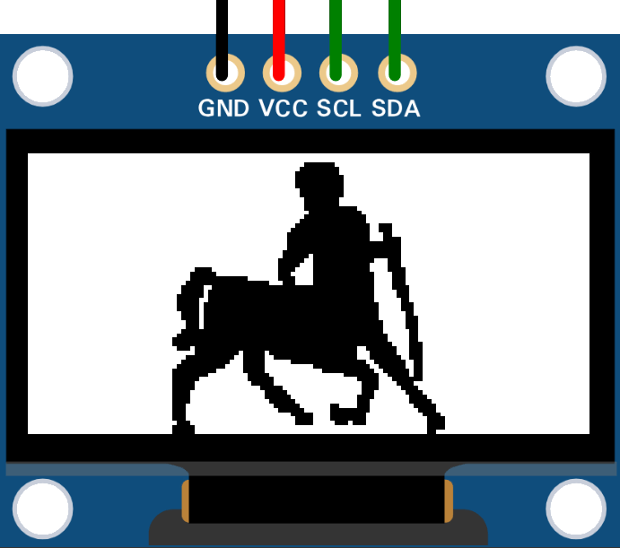
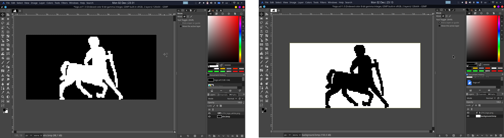
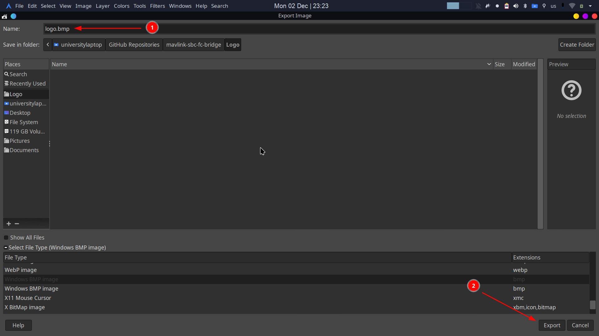

# How to Create and Integrate Your Custom Logo

<p align="center">
  
</p>

This guide explains how to use the provided GIMP (`.xcf`) files, convert the logo to a binary format using ImageMagick, and directly use the file in your code for an SSD1306 OLED display with the u8g2 library.

---

## 1. Edit the Logo `(Using GIMP)`

1. **Open the `.xcf` File:**
   - Open the provided `.xcf` file (either with a black or white background) in GIMP.

    <p align="center">
      
    </p>

    <p align="center">
        The file is already sized to 128x64 pixels, perfect for SSD1306 OLED displays.
    </p>

2. **Add Your Image or Text:**
   - Design your logo or add text within the provided dimensions.

    <p align="center">
      
    </p>

    <p align="center">
        Ensure the content contrasts appropriately with the background (black or white).
    </p>

  > **Note:**  
  > Using a white logo on a black background is highly power-efficient for OLED displays. Pixels remain off (consuming less power) where the background is black, while only the white pixels draw power. This approach extends battery life, making it ideal for portable and low-power applications.

3. **Export as BMP:**
   - After editing, export the logo to a BMP file:
     - Go to `File > Export As`.
     - Choose **BMP image** format and save as `logo.bmp`.
     - Ensure the export settings use **grayscale** to simplify the binary conversion process.

    <p align="center">
      
    </p>
---

## 2. Convert BMP to BIN `(Using ImageMagick)`

1. **Install ImageMagick** if it's not already installed. Use:
   - Linux: 
     ```bash
     sudo apt install imagemagick
     ```
   - Windows/macOS: Download from [ImageMagick.org](https://imagemagick.org).

2. **Convert the BMP to BIN:**
   - Use the following command to convert the BMP image into a binary file:
     ```bash
     magick logo.bmp -monochrome -colors 2 -type bilevel -write MONO:logo.bin
     ```
   - This creates a `logo.bin` file compatible with the SSD1306 OLED.

---

## 3. Convert the Binary File to a Byte Array `(Using xxd)`

1. **Convert `logo.bin` into a C Array**

   - Convert `logo.bin` into a C array using the `xxd` tool:
     ```bash
     xxd -i logo.bin > logo.h
     ```
   - This will create a file `logo.h` containing the image data as a byte array (e.g., `unsigned char logo_bin[]`).

2. **Add Include Guards to the Header File**

   - Use the `add_guards.sh` script to add include guards and prevent multiple inclusions of `logo.h`, which can lead to redefinition errors during compilation.
     - Make the script executable:
       ```bash
       chmod +x add_guards.sh
       ```
     - Run the script:
       ```bash
       ./add_guards.sh logo.h
       ```
   - Add `#include "logo.h"` in your code.

3. **Draw the Image**

   - Use `u8g2_DrawXBM` with the binary array:
     ```cpp
     u8g2_DrawXBM(&u8g2, -2, 15, 128, 64, logo_bin); // Adjust X and Y positions if necessary
     ```

---

## Folder Structure

```plaintext
.
├── Black baground
│   ├── add_guards.sh        # Script to add include guards
│   ├── logo.bin             # Binary file for black background
│   ├── logo.bmp             # BMP file for black background
│   ├── logo.h               # Header file containing the byte array for black background
│   ├── logo.xcf             # Editable GIMP file for black background
│   └── UTH_logo_white.png   # PNG preview for black background
├── White baground
│   ├── add_guards.sh        # Script to add include guards
│   ├── logo.bin             # Binary file for white background
│   ├── logo.bmp             # BMP file for white background
│   ├── logo.h               # Header file containing the byte array for black background
│   ├── logo.xcf             # Editable GIMP file for white background
│   └── UTH_logo.png         # PNG preview for white background
└── logo.md                  # Instructions file
```
