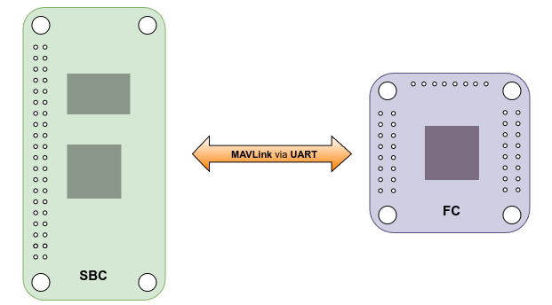
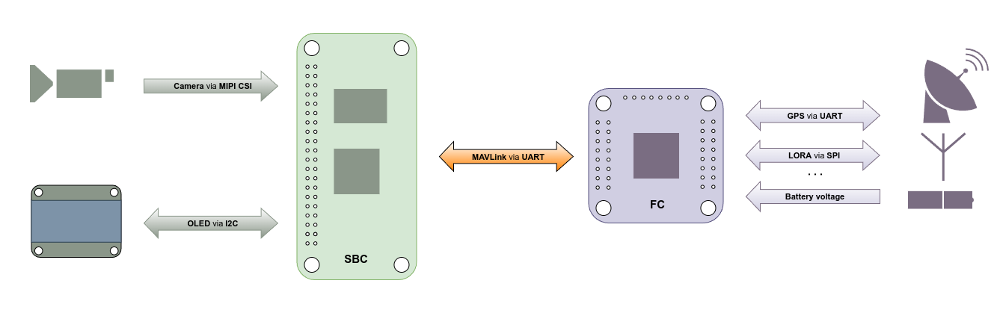
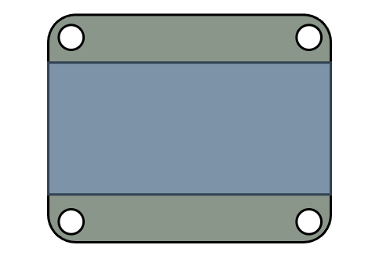
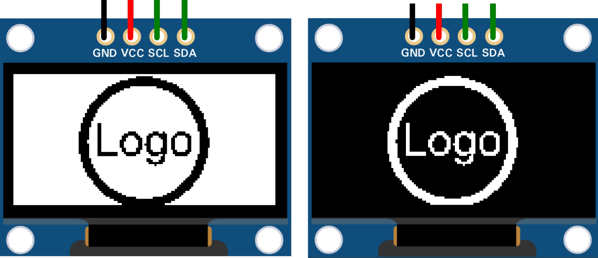
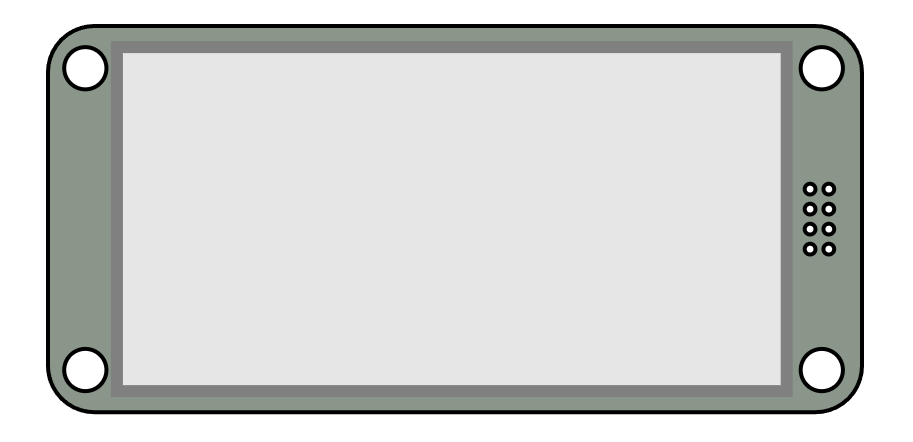

# Autonomous UAVs: MAVLink Communication Between FCs and SBCs

  

## Integrating Peripherals for Status Display and Image Processing in UAVs

### Option 1: Using an OLED Display

For monochrome OLEDs and LCDs:
<ol style="line-height: 2; list-style-type: none;">
   <li>
      

        
U8g2 Library Setup

        
Navigate to the u8g2 directory:

        <pre><code>cd ~/u8g2</code></pre>
        
Create a build directory and navigate into it:

        <pre><code>mkdir build && cd build</code></pre>
        
Run CMake to configure the project:

        <pre><code>cmake ..</code></pre>
        
<strong>Output:</strong>

        

        -- The C compiler identification is GNU 10.2.1 
        -- The CXX compiler identification is GNU 10.2.1 
        -- Detecting C compiler ABI info 
        -- Detecting C compiler ABI info - done 
        -- Check for working C compiler: /usr/bin/cc - skipped 
        -- Detecting C compile features 
        -- Detecting C compile features - done 
        -- Detecting CXX compiler ABI info 
        -- Detecting CXX compiler ABI info - done 
        -- Check for working CXX compiler: /usr/bin/c++ - skipped 
        -- Detecting CXX compile features 
        -- Detecting CXX compile features - done 
        -- Configuring done 
        -- Generating done 
        -- Build files have been written to: /home/radxa/u8g2/build
        

        
Build the project:

        <pre><code>make</code></pre>
        
<strong>Output:</strong>

        

        Scanning dependencies of target u8g2 
        [  0%] Building C object CMakeFiles/u8g2.dir/csrc/mui.c.o 
        [  1%] Building C object CMakeFiles/u8g2.dir/csrc/mui_u8g2.c.o 
        [  2%] Building C object CMakeFiles/u8g2.dir/csrc/u8g2_arc.c.o 
        [  3%] Building C object CMakeFiles/u8g2.dir/csrc/u8g2_bitmap.c.o 
        ... 
        [ 97%] Building C object CMakeFiles/u8g2.dir/csrc/u8x8_string.c.o 
        [ 98%] Building C object CMakeFiles/u8g2.dir/csrc/u8x8_u16toa.c.o 
        [ 99%] Building C object CMakeFiles/u8g2.dir/csrc/u8x8_u8toa.c.o 
        [100%] Linking C static library libu8g2.a 
        [100%] Built target u8g2
        

        
Install the library:

        <pre><code>sudo make install</code></pre>
        
<strong>Output:</strong>

        

        Install the project... 
        -- Install configuration: "" 
        -- Installing: /usr/local/lib/libu8g2.a 
        -- Installing: /usr/local/include/u8g2/mui.h 
        -- Installing: /usr/local/include/u8g2/mui_u8g2.h 
        -- Installing: /usr/local/include/u8g2/u8g2.h 
        -- Installing: /usr/local/include/u8g2/u8x8.h 
        -- Installing: /usr/local/lib/cmake/u8g2/u8g2-targets.cmake 
        -- Installing: /usr/local/lib/cmake/u8g2/u8g2-targets-noconfig.cmake 
        -- Installing: /usr/local/lib/cmake/u8g2/u8g2-config.cmake
        

         
Create a Symlink for Easier Access:

         <pre><code>sudo ln -s /usr/local/include/u8g2 /usr/local/include/u8g2</code></pre>
      

   </li>
   <li>
      

         
      

      <a href="./Logo/README.md">Create and integrate your custom logo as Splash Screen</a>
   </li>  
</ol>
 

### Option 2: Using an E-ink Display

For E-ink (ePaper) and TFT LCD displays:
<ol style="line-height: 2; list-style-type: none;">
   <li>
      

        
LVGL Library Setup

        <ol style="line-height: 2; list-style-type: none;">
            <li>
               

               
1. Clone the LVGL Repository

               
Clone the LVGL GitHub repository:

               <pre><code>git clone https://github.com/lvgl/lvgl.git</code></pre>
               
Enter the cloned directory:

               <pre><code>cd lvgl</code></pre>
               

            </li>
            <li>
               

               
2. Configure Your Build System

               
For a standard CMake setup:

               <pre><code>mkdir build && cd build</code></pre>
               <pre><code>cmake ..</code></pre>
               
Add LVGL to your `CMakeLists.txt`:

               <pre><code>add_subdirectory(lvgl)
         include_directories(lvgl)
         target_link_libraries(your_project lvgl)</code></pre>
               

            </li>
            <li>
               

               
3. Configure LVGL Settings

               
Modify `lv_conf.h`:

               <pre><code>#define LV_COLOR_DEPTH 16
         #define LV_HOR_RES_MAX 240
         #define LV_VER_RES_MAX 320</code></pre>
               

            </li>
         </ol>
      

   </li>
</ol>

### Option 3: Using the FC plus board

