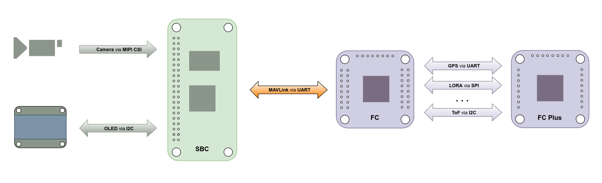

# Autonomous UAVs: MAVLink Communication Between FCs and SBCs

<p align="center">
  
</p>

This repository explores MAVLink communication between flight controllers and SBCs, enabling UAV autonomy with features like peripheral integration and real-time image processing.

## Integrating Peripherals for Status Display and Image Processing in UAVs


### 1. Camera for Image Processing
Cameras can enhance UAV capabilities by enabling image processing tasks such as object detection, tracking, and navigation. These tasks can be performed on the SBC and integrated into any of the following setups: OLED displays, e-ink displays, or FC plus boards.

<ol style="line-height: 2; list-style-type: none;">
<details>
<summary>Steps to Integrate the Camera</summary>

#### 1. Set up the Camera on the SBC

Ensure the camera module is compatible with your SBC. Connect the camera securely and verify it is recognized by the SBC's operating system.

```bash
# Check if the camera is detected
ls /dev/video*
```

#### 2. Install Required Libraries for Image Processing

Install software such as OpenCV for image capture and processing:

```bash
sudo apt update
sudo apt install libopencv-dev python3-opencv
```

#### 3. Test the Camera

Run a basic Python script to test the camera:

```python
import cv2

cap = cv2.VideoCapture(0)
while True:
    ret, frame = cap.read()
    if not ret:
        break
    cv2.imshow('Camera Feed', frame)
    if cv2.waitKey(1) & 0xFF == ord('q'):
        break
cap.release()
cv2.destroyAllWindows()
```

#### 4. Develop Image Processing Features

Implement tasks like object detection, lane following, or obstacle avoidance using frameworks such as TensorFlow Lite, YOLO, or custom algorithms.

#### 5. Communicate Results to the Flight Controller

Use MAVLink messages to send image processing data (e.g., detected object coordinates) to the flight controller for UAV decision-making.

```python
from pymavlink import mavutil

# Establish a connection
master = mavutil.mavlink_connection('udpout:127.0.0.1:14550')

# Send processed data
master.mav.object_detection.send(
    obj_id=1,
    x=50,
    y=50,
    z=10
)
```
</details>
</ol>

### 2. Display Integration Options

Three different ways to integrate a display into your project. Choose the option that best fits your requirements and hardware capabilities.

<ol style="line-height: 2; list-style-type: none;">
<details>
<summary>Option 1: Using an OLED Display</summary>


For monochrome OLEDs and LCDs:
<ol style="line-height: 2; list-style-type: none;">
   <li>
      <details>
        <summary>U8g2 Library Setup</summary>
        <p>Navigate to the u8g2 directory:</p>
        <pre><code>cd ~/u8g2</code></pre>
        <p>Create a build directory and navigate into it:</p>
        <pre><code>mkdir build && cd build</code></pre>
        <p>Run CMake to configure the project:</p>
        <pre><code>cmake ..</code></pre>
        <p><strong>Output:</strong></p>
        <p>
        -- The C compiler identification is GNU 10.2.1<br>
        -- The CXX compiler identification is GNU 10.2.1<br>
        -- Detecting C compiler ABI info<br>
        -- Detecting C compiler ABI info - done<br>
        -- Check for working C compiler: /usr/bin/cc - skipped<br>
        -- Detecting C compile features<br>
        -- Detecting C compile features - done<br>
        -- Detecting CXX compiler ABI info<br>
        -- Detecting CXX compiler ABI info - done<br>
        -- Check for working CXX compiler: /usr/bin/c++ - skipped<br>
        -- Detecting CXX compile features<br>
        -- Detecting CXX compile features - done<br>
        -- Configuring done<br>
        -- Generating done<br>
        -- Build files have been written to: /home/radxa/u8g2/build
        </p>
        <p>Build the project:</p>
        <pre><code>make</code></pre>
        <p><strong>Output:</strong></p>
        <p>
        Scanning dependencies of target u8g2<br>
        [  0%] Building C object CMakeFiles/u8g2.dir/csrc/mui.c.o<br>
        [  1%] Building C object CMakeFiles/u8g2.dir/csrc/mui_u8g2.c.o<br>
        [  2%] Building C object CMakeFiles/u8g2.dir/csrc/u8g2_arc.c.o<br>
        [  3%] Building C object CMakeFiles/u8g2.dir/csrc/u8g2_bitmap.c.o<br>
        ...<br>
        [ 97%] Building C object CMakeFiles/u8g2.dir/csrc/u8x8_string.c.o<br>
        [ 98%] Building C object CMakeFiles/u8g2.dir/csrc/u8x8_u16toa.c.o<br>
        [ 99%] Building C object CMakeFiles/u8g2.dir/csrc/u8x8_u8toa.c.o<br>
        [100%] Linking C static library libu8g2.a<br>
        [100%] Built target u8g2
        </p>
        <p>Install the library:</p>
        <pre><code>sudo make install</code></pre>
        <p><strong>Output:</strong></p>
        <p>
        Install the project...<br>
        -- Install configuration: ""<br>
        -- Installing: /usr/local/lib/libu8g2.a<br>
        -- Installing: /usr/local/include/u8g2/mui.h<br>
        -- Installing: /usr/local/include/u8g2/mui_u8g2.h<br>
        -- Installing: /usr/local/include/u8g2/u8g2.h<br>
        -- Installing: /usr/local/include/u8g2/u8x8.h<br>
        -- Installing: /usr/local/lib/cmake/u8g2/u8g2-targets.cmake<br>
        -- Installing: /usr/local/lib/cmake/u8g2/u8g2-targets-noconfig.cmake<br>
        -- Installing: /usr/local/lib/cmake/u8g2/u8g2-config.cmake
        </p>
         <p>Create a Symlink for Easier Access:</p>
         <pre><code>sudo ln -s /usr/local/include/u8g2 /usr/local/include/u8g2</code></pre>
      </details>
   </li>
   <li>
      <p align="left">
         
      </p>
      <a href="./Logo/README.md">Create and integrate your custom logo as Splash Screen</a>
   </li>  
</ol>
 
</details>
</ol>

<ol style="line-height: 2; list-style-type: none;">
<details>
<summary>Option 2: Using an E-ink Display</summary>


For E-ink (ePaper) and TFT LCD displays:
<ol style="line-height: 2; list-style-type: none;">
   <li>
      <details>
        <summary>LVGL Library Setup</summary>
        <ol style="line-height: 2; list-style-type: none;">
            <li>
               <details>
               <summary>1. Clone the LVGL Repository</summary>
               <p>Clone the LVGL GitHub repository:</p>
               <pre><code>git clone https://github.com/lvgl/lvgl.git</code></pre>
               <p>Enter the cloned directory:</p>
               <pre><code>cd lvgl</code></pre>
               </details>
            </li>
            <li>
               <details>
               <summary>2. Configure Your Build System</summary>
               <p>For a standard CMake setup:</p>
               <pre><code>mkdir build && cd build</code></pre>
               <pre><code>cmake ..</code></pre>
               <p>Add LVGL to your `CMakeLists.txt`:</p>
               <pre><code>add_subdirectory(lvgl)
         include_directories(lvgl)
         target_link_libraries(your_project lvgl)</code></pre>
               </details>
            </li>
            <li>
               <details>
               <summary>3. Configure LVGL Settings</summary>
               <p>Modify `lv_conf.h`:</p>
               <pre><code>#define LV_COLOR_DEPTH 16
         #define LV_HOR_RES_MAX 240
         #define LV_VER_RES_MAX 320</code></pre>
               </details>
            </li>
         </ol>
      </details>
   </li>
</ol>

</details>
</ol>

<ol style="line-height: 2; list-style-type: none;">
<details>
<summary>Option 3: Using the FC plus board</summary>




</details>
</ol>

## Related Projects

**FC Plus** is a modular add-on board for UAV flight controllers, offering advanced features such as telemetry, GPS, object avoidance (ToF, Sonar, IR), and LED indicators for status feedback. This repository includes comprehensive documentation, hardware setup instructions, sensor integration guides, and communication protocols (LoRa/WiFi) to improve UAV autonomy, safety, and performance.

<div align="center">


[](https://github.com/Paschalis/fc-plus-sensor-module)
[](https://github.com/Paschalis/fc-plus-sensor-module/stargazers) [](https://github.com/Paschalis/fc-plus-sensor-module/network/members) [](https://github.com/Paschalis/fc-plus-sensor-module/commits/main)

</div>

Explore more about the **FC Plus Sensor Module** and its integration into UAV systems by clicking on the badge above to access the full documentation and setup guide.


## Contributing

Your contributions and suggestions are crucial for the improvement of this project!  Feel free to submit pull requests or open issues if you encounter any problems.

## License

This project is licensed under the [GPLv3 License](https://opensource.org/licenses/GPL-3.0) - see the [LICENSE](LICENSE) file for details.


---

**Thank you for visiting mavlink-sbc-fc-bridge!**

